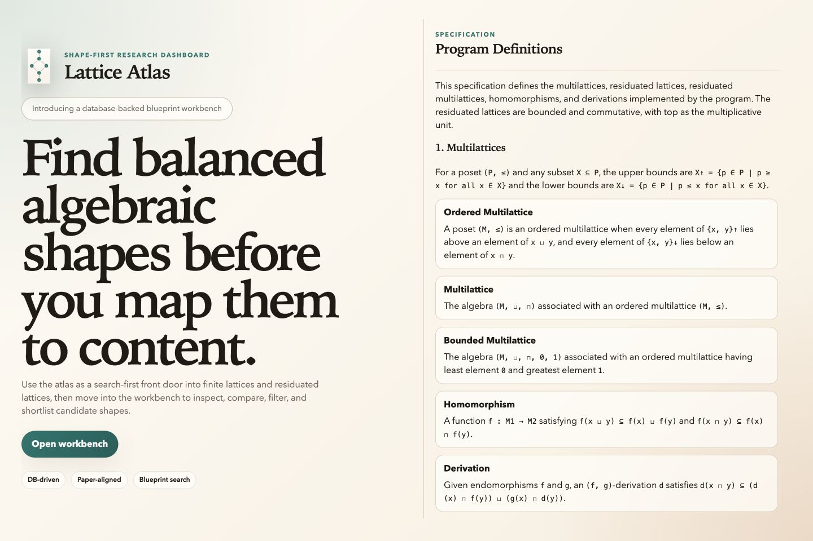
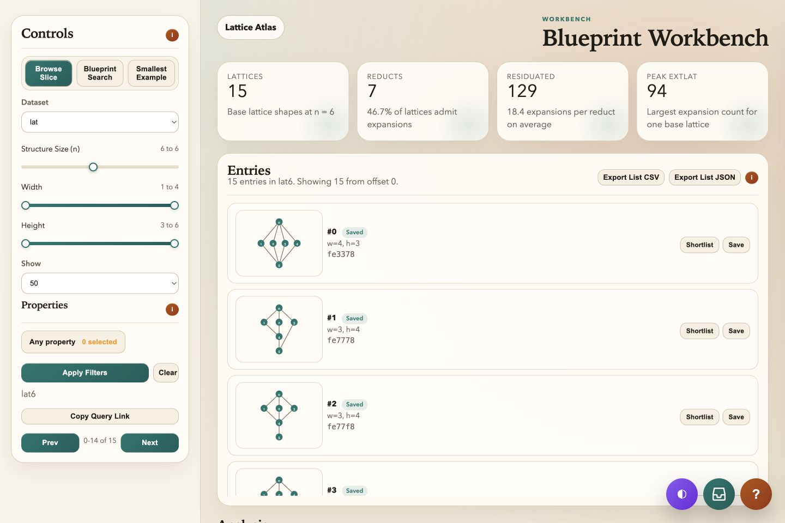
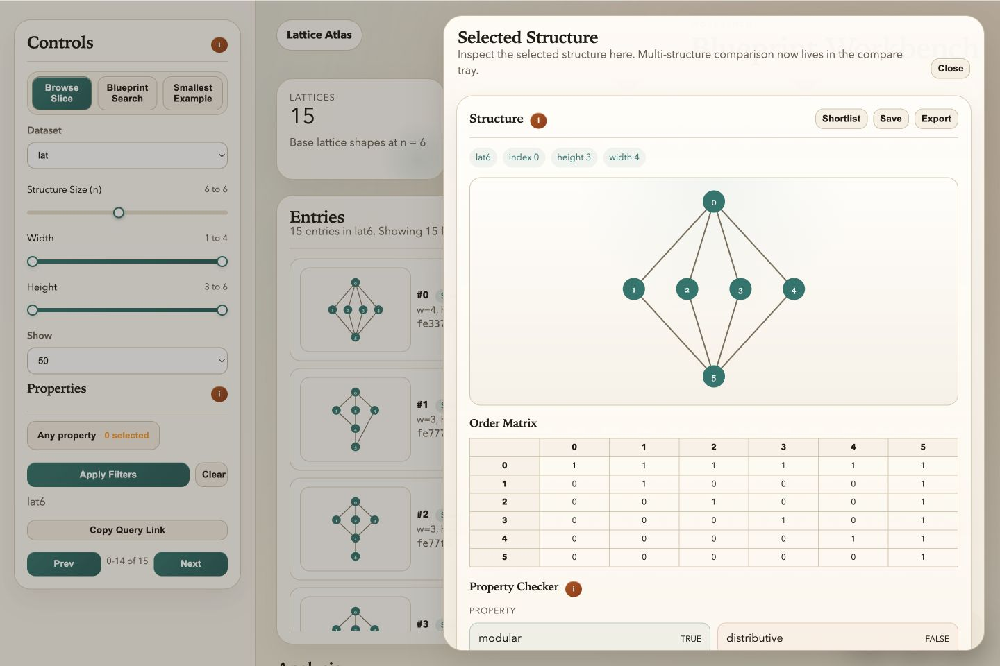
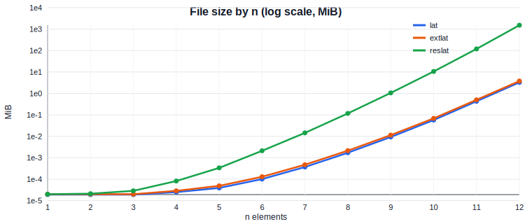
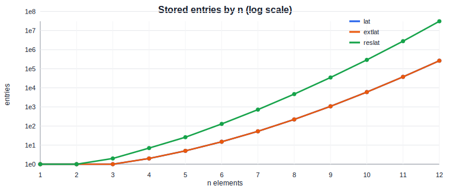

# Lattice Atlas

Lattice Atlas is a database-backed dashboard for exploring finite lattices, lattice reducts, and residuated lattices up to size `n <= 12`.

It is currently shaped as a search-first research workbench:
- browse slices of `lat`, `extlat`, and `reslat`
- inspect decoded structures with diagrams and tables
- search for candidate blueprint shapes by structural constraints
- compare shortlisted structures side by side
- review aggregate metrics, appendix-style tables, and property co-occurrence

## Screenshots

### Landing page



### Workbench overview



### Selected structure drawer



## What the project does

- Serves a landing page and a full browser workbench from a local FastAPI app
- Reads `.db` dataset files for `lat`, `extlat`, and `reslat`
- Decodes stored structures into:
  - Hasse-style diagram previews
  - order matrices
  - multiplication tables for `reslat`
  - derived operations such as residuum and negation where available
- Computes structural properties directly from the data rather than from hardcoded result tables
- Stores saved blueprints and search metadata in SQLite under `artifacts/dashboard.sqlite3`
- Supports persistent indexed metadata search so large blueprint searches do not scan the raw datasets on every request

## Current workbench features

- `Browse Slice`: page through a dataset/size slice with structural filters
- `Blueprint Search`: search across an `n` range using width, height, count, and property constraints
- `Smallest Example`: find the least-size witness for selected properties
- `Selected Structure` drawer:
  - diagram
  - order table
  - multiplication table when applicable
  - property checker
  - encoding block
- `Compare Tray`: shortlist up to three saved structures and inspect them side by side
- `Design-Language Balance Report`
- `Counter-Gap Analysis`
- `Same-Lattice Expansions` for `reslat`
- `Count Trends`
- `Width × Height` distribution
- `Top extlat Expansion Counts`
- `Appendix Tables`
- `Property Co-Occurrence`
- JSON and CSV export actions

## Quick start

### 1. Install dependencies

```bash
python3 -m venv .venv
source .venv/bin/activate
pip install -r requirements.txt
```

### 2. Ensure data is present

The app expects dataset files under `data/`.

If you have the archive at the repo root:

```bash
./extract_data.sh
```

### 3. Start the app

```bash
python3 app.py
```

Then open:

- [http://127.0.0.1:8000/](http://127.0.0.1:8000/)
- [http://127.0.0.1:8000/workbench](http://127.0.0.1:8000/workbench)

## Indexed search

Blueprint search now uses a persistent SQLite-backed metadata index instead of building all search metadata inside the request path.

This matters most for large `reslat` slices.

### Build index slices

For a single slice:

```bash
python3 -m dashboard.metadata_index --dataset reslat --n 12
```

For a range:

```bash
python3 -m dashboard.metadata_index --dataset reslat --n 11 --n 12
```

For all available sizes in a dataset:

```bash
python3 -m dashboard.metadata_index --dataset lat --all
```

### Resume behavior

Long index builds are checkpointed.

If you interrupt a patched index run, rerun the same command and it should resume from the last committed checkpoint instead of restarting from zero.

## Typical workflow

1. Start at the landing page and open the workbench.
2. Browse a base slice such as `lat6` or `reslat8`.
3. Filter by width, height, count, or properties.
4. Open a structure into the drawer and inspect its shape, matrices, and properties.
5. Save interesting candidates as blueprints.
6. Shortlist up to three saved candidates into the compare tray.
7. Switch to `Blueprint Search` to search across a size range.
8. Use aggregate panels to understand counts, distributions, and co-occurrence patterns.

## Current boundaries

This repository is a research dashboard and structure workbench. It is not yet the full downstream game engine or behavior-mapping system.

Right now it is strongest at:
- dataset inspection
- shape search
- structural comparison
- algebra/property validation
- aggregate browsing

## Project layout

- [app.py](app.py)
  - top-level entrypoint
- [dashboard](dashboard)
  - backend app, analytics, dataset loading, storage, indexed search
- [web](web)
  - landing page, workbench page, styles, and frontend modules
- [artifacts](artifacts)
  - SQLite storage, metadata cache, generated charts
- [docs](docs)
  - completed feature notes, plans, and future work
- [src](src)
  - imported mathematical/program sources and reference material

## Existing artifacts

Generated charts already present in the repo:

- 
- 

## Additional docs

- [Priority list](docs/plan/README-priority-list.md)
- [Completed feature notes](docs/completed)
- [Planned work](docs/plan)
- [Future work](docs/future)

## Tech stack

- Python
- FastAPI
- SQLite
- Plain HTML, CSS, and modular browser JavaScript

## Status

The repository is in an active research-tooling phase.

The main product surface is the workbench at `/workbench`, backed by:
- live dataset decoding
- persistent blueprint/session storage
- resumable metadata indexing for search
